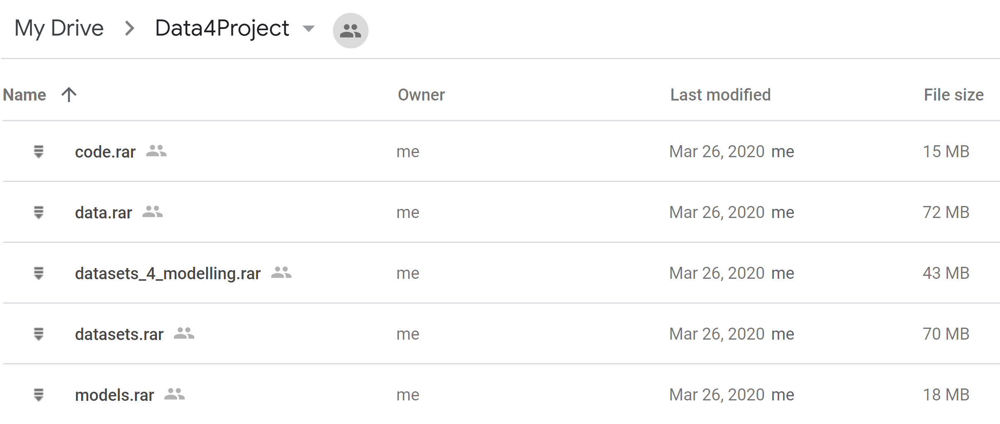

## Project Goals

The main purpose of this project is to **build and train models which could be used to predict the quotation of shares of public companies**.  

As input data for training and testing models is used real data ~ 6 900 companies presented daily quotes for 5 years, downloaded through the [API service](https://financialmodelingprep.com/developer/docs/), which provides publicly available data and easy-to-use interface.   

The project is more research-oriented and does not pursue any commercial goals. As part of the search for solutions to a key objective, several important questions can be identified, the answers to which will be consistently formed as the project progresses:

- ***How to group (or cluster) the sample of considered companies?***

- ***Which of the algorithms under consideration (SARIMA or RNN) are better suited for making robust forecasts?***

- ***Is it possible to make qualitative long-term forecasts using the above algorithms?***

- ***Can the quality of forecasting be improved by adding data from the financial statements to the input?***

- ***Can a model which trained on a cluster's representative time serie be used for forecasting on data from other time series in that cluster?***

It should be noted that the first and last questions are a direct consequence of a large number of loaded companies. As a rule, in researches of time series models, usually, the time series is presented in the singular as the studied data. However, consideration of the widest possible sample of companies (with a reasonable number of models) and corresponding conclusions, in my opinion, will be much more generalized and objective.  It also means that the main result of the project is not a specific trained model, which is already applicable to specific businesses, but a fundamental understanding of the potential of using such models.  

The use of clustering mechanics, in this case, is partly a forced measure, as it is not possible to build individual models for all initial time series in a reasonable time frame.

## Repository Structure

The main stages of research are located in ipynb files and are made in the classical style of research projects, including commenting and outputting the results of intermediate steps. For convenience, the beginning of all files is numbered and corresponds to the sequence of main project stages.

- `S1_DataScrapping.ipynb` (Data Loading from WEB)

- `S2_DataConsolidation.ipynb` (Consolidating csv-files data to 1 DataFrame)

- `S3_DataCleaning.ipynb` (Filtering and Cleaning)

- `S4_EDA_Clustering.ipynb` (Grouping and Clustering)

- `S5_ARIMA.ipynb` (SARIMA modelling)

- `S6_RNN_Basic.ipynb` (RNN modelling)

- `S7_RNN_FS.ipynb` (RNN with financial statement data added)

Each file begins with a description of the algorithms and functions used, limitations and features of the launch, etc. Also, many cells are accompanied by comments, so it is recommended to read these files for detailed study of all aspects of the project. I also used my functions, which are placed in the `project_lib.py`. Besides brief description in notebooks, each function has docstring. As it was mentioned before, this project is a research project, so there are no files with automatic code launch and/or own web-interface.

The data that were downloaded weigh about 280 megabytes and represent a collection of more than 10 000 files. As the project progresses, derived files such as merged tables, dictionaries and models are also generated. As a result, the total files size increases to ~ 600 Mb. So, I have placed all these files (archived versions) on a Google drive, which can be accessed via this [link](https://drive.google.com/open?id=11Zw-DvNbpc_lc3kj4AFzwESaKZ6Rs-0M).  

  

If necessary, all the files must be unpacked to the root folder of the project, saving the structure that is in the 
archive. The structure of the project folders with data looks like this:  

    

Also, repository consists of the following files:

- `README.md`
- `LICENSE.md`
- `CONTRIBUTING.md`
- `Presentation.pdf` (Project Results for non-technical specialists)
- `pics` folder (pics for README.md)

## Project Main Stages: description

The main stages of the Project can be schematically presented as follows:

 

### Data Loading and Cleaning

This stage is implemented in the first three notebooks and includes loading, cleaning, filtering data and preparing data for clustering and modeling. The peculiarity of the loaded data is that for each company a separate csv file with quotes was created, and taking into account the long duration of some operations (for example, merging the data of all files into one table), I divided this stage into three files with consecutive saving of intermediate results in special files.  I also separately uploaded data with company profiles containing general information about companies.

The following key steps can be distinguished within this step:

- input data upload

- company filtering (exclusion of derivatives such as S&P)

- integration of data into a single table

- definition of an effective timeline of covering a large number of quotations

- missing values filling

- preparation of intermediate files for the following stages and pct-conversion of quotes

### Clustering

At this stage the analysis of the main statistics and visual analysis of the data were carried out to be able to split the sample of companies into main groups and to identify representative time series (centers) for each such group. 
Methodologically, 3 algorithms of clusetring have been considered:

- Breakdown by characteristics of companies from the company profiles static table

- Selecting clusters using the KMeans algorithm

- Selecting clusters using time series correlation.

The third method is experimental and was invented by me as an alternative to the first two. Detailed steps and results of this algorithm, as well as the previous two - see the next section of README.

The important point here is that as a time series, I used modified time series, where the value is represented not by the price itself, but by the profitability (NetPriceMargin), which is equivalent to scaling, and allows comparing quotes of different companies.

### ARIMA

From this stage onwards, only selected and calculated time series that are the centres of their clusters are used to form and test models. In total, there are 26 such centres.  

At this stage, the modelling of the selected centres of clusters using SARIMA library statsmodels. The whole process includes the following steps:

- graphical analysis of time series with rolling mean and rolling std with different window

- Time-series statistical analysis (ACF, PACF, ADF-test)

- finding the optimal hyperparameters for each time series

- model training on optimal hyperparameters

- short-term forecasting in a test sample (1-step-ahead)

- full-cycle long-term prediction

- calculation and consolidation of final metrics.

It should be noted that in contrast to clusterization, normalized prices (prices of the time series have been divided into the corresponding prices of the first day of quotes) have been taken as time series, rather than profitability, because, as calculations have shown, using profitability indicators (distributed around zero) is not the best option for forecasting.

### RNN modelling (LSTM)

This stage includes the following steps:

- visual data analysis and adding categorical data based on DateTime.

- selection of the optimal model architecture based on 2 randomly selected time series.

- training of all models in question.

- generation of short-term (1-step) and long-term (20% of a timeline) forecasts and calculation of R2 metric.

- Testing of randomly selected cluster companies on trained cluster models.

At this stage, only data with normalized prices were used as time series. Despite the relative duration of the search of parameters, I have saved in the notebook the history of a grid search of parameters with the output of charts with learning curves on some reduced space of hyperparameters.

### RNN modelling with Financial Statement data added (LSTM FS)

At this stage, two models are compared: RNN from the previous step, which accepts only time series and date data input, and RNN, which is added to the financial statements.  

In this case, RNN from the previous step is presented in an optimized version with changed hyperparameters. Only one company was selected due to the availability of data. Please see important disclaimer about that in `S7_RNN_FS.ipynb`. 

Basic steps:

- retrain base RNN with parametric search, ST and LT prediction and R2 score calculation

- financial statement loading

- feature engineering (from FS)

- RNN with FS: param search, ST and LT prediction and R2 score calculation.

## Project Main Stages: detailed results

This part will present fairly detailed steps and research results. Parts of no particular importance will be omitted.

### Step 1. Data Loading and Cleaning

#### Data Loading, Filtering and Consolidating processes

This stage takes several steps and realized in `S1_DataScrapping.ipynb` and `S2_DataConsolidation.ipynb`:

-	Loading all available symbols: in total ~ 13 900, including ~1000 dublicates

-	Dropping tickers which represents 
	- famous composites (Dow Jones, S&P, AMEX, NASDAQ, NYSE, Russel, Wilshire, CAC, DAX, FTSE, Nikkei, TSE): ~600 tickers dropped
    - ETF, Mutual Funds and Cryptocurrencies ~ 1 900 tickers dropped

-	Company profiles loading for remained tickers

-	Stock price loading for remained tickers

-	Creating 1 DataFrame for all prices

#### Data Loading, Filtering and Consolidating processes

- available time period

  - It is normal, that companies can be delisted or created at any date in considered timeline. The main task: to select a time interval that will contain a large number of companies, while not being too short.
  
  - The optimum chosen period is from 2016-01-04 to 2020-01-06, the number of companies whose quotations are available in this period is ~ 6,900.
  
   
 

- Missing values in Prices

  - total NANs in the dataset ~ 3.2%, which were filled by interpolation averaging
  

- Missing values in Profiles
  
  - NANs in Sector and Industry features were replace by a new category "Diversified"
  

- Data Conversion
  
  - for Clustering Stage absolute prices were converted to NetPriceMargins by pct-method
  - NetPriceMargin(t) = (P(t) - P(t-1)) / P(t)

### Step 2. Clustering

All code lines for this stage - in `S4_EDA_Clustering.ipynb`

#### Grouping based on categorical features

After some processing of Profiles, two versions of data grouping were formed: by sector and exchange.

 

Visual look of companies Net Price Margins dynamics inside the groups with monthly rolling mean:

 

Next, the so-called composites for each formed group were formed, calculated as a median value for each period of time and the corresponding values of interquartile range (q25 - q75) for visual analysis of the composite dynamics.

The width of the boundaries of the interquartile range indicates the degree of homogeneity of companies in the group. In the case of the sets under consideration, I chose a sector in which the groups are more homogeneous. The several examples of visualization are presented below.

As a result, 12 clusters were formed, covering the entire sample of companies.

#### KMeans

I applied the standard clustering method KMeans++, included in the SCIKIT-Learn library on NetPriceMargins data. 

As can be seen from the results, the optimal number of clusters is 9, but on the whole considered range silhouette score - negative, so clustering by this method is not achievable.

#### Clustering based on Correlation Matrix

This method has been realized with manual functions and library NetworkX.
Since this method is not a standard one, all steps of its implementation will be described in detail below.

- Step 1. A correlation matrix was formed from NetPriceMargin.

- Step 2: For each company, a list of companies with which the correlation exceeds threshold = 0.65 has been generated.
  - As a result, I obtained 2,293 clusters containing from 2 to 594 companies and covering 33% of all companies. At the same time, many clusters were strongly overlapping.

- Step 3: Restrictions were imposed on the maximum number of clusters (200), clearing of intersections and the minimum threshold for the number of companies in a cluster (10). 
  - As a result, 14 clusters were received covering 856 companies (12% of the total), the average number of companies in the cluster - 61.

- Step 4: Defining the centre of the cluster.
  - Unlike Sector Composites, in the case of clusters, I decided to define them as the centres of the graphs. In this case, the nodes of the graph are companies, the edges are lined up between the companies with a correlation above. 

An example of a visualization of such a graph is below:

 

The advantages of this approach over grouping by sector are that the relationship or homogeneity of the companies included in the cluster is taken into account more explicitly in time series, as well as the fact that the centre of the cluster is taken not a certain derivative index (Composite Median), but a specific company. One of the drawbacks is a weak coverage of the entire sample. 

As can be seen from several examples, the inter-apartment spreads of the formed clusters repeat the cluster centres quite well.

 
 
 

So, 2 groups of clusters were formed for modeling and testing time series: 
- on the basis of grouping by sectors (12 clusters) 
- on the basis of correlation (14 clusters).

### Step 3. ARIMA

As first step, for a randomly selected composite (Financial sector), trial model training and prediction were carried out with the following results:
- optimal SARIMAX params: (0-0-0) - (1-0-1-1)
- R2 for 1-step forecast on TEST data - 1.4%

 

As expected, the use of profitability indicators (NetPriceMargin) distributed around 0 does not allow achieving quality models. Therefore, it was decided to move to the modelling of normalized base prices, which are mostly non-stationary (based on ADF-tests), have trends and cycles, have strong autocorrelation dependence (based on ACF and PACF), and differ from each other. 

We can also talk about some stability of the variation.

For each time series, a different configuration of optimal hyperparameters was selected, after all, models were trained and saved in the table.

In general, short-term forecasts showed high values of R2 metrics: from 0.86 to 0.97. For long-term forecasts (216 days), all indicators are unsatisfactory. The graphs below illustrate this.

The chart below shows the density of r2 scores for two cluster sets.

In general, the differences between the groups are insignificant and R2 scores are good for short-term forecasting.

### Step 4. RNN Modelling

As for ARIMA, this part will use 26 time-series presented as Normalized Prices, which will be further scaled by MinMaxScaler and reorganized to 3D-tensor with window size = 90 days. The size of such window was determined during preliminary internal tests. 

As mentioned earlier, for EDA and architecture definition 2 randomly defined centres were selected: Financial (from composites) and IXG (from corr-clusters). 

Also note that in addition to the r2 metric, I also calculated accuracy and f1 metrics based on modified in binary strings y_true and y_predict, where class = 1, if y(t) - y(t-1) > 0, 0 - in other cases. However, these metrics do not play a significant role in the conclusions and are made optionally.

#### Features Engineering

The EDA part in this case is represented by a small study that reveals the dependence of target from days_of_week, month and day_of_month.  

 

2 additional features were added to Input: month and day_of_month

#### HyperParameters search

The selection of hyperparameters defining the RNN architecture was carried out on a reduced hyperparameter space, after some preliminary internal studies. In particular, it was found out:

- the optimal number of LSTM layers: 1 (any additional layers lead to overfitting)  

- optimal input tensor window size: 90  

- optimal activation function: ReLU  

- optimal optimizer: ADAM  

Presented in `S6_RNN_Basic.ipynb`, grid search was based on the following ranges:

- LSTM-nodes: {32, 96, 128}

- Dropout Rate: {0.10, 0.15, 0.25}

When launching the models I used the number of epochs - 150, batch size = 16 and EarlyStopping callback (triggered on val_loss with length = 0.2 of all epochs).  
Examples of visualization curves for Financial and IXG. 

 

 

A final comparison of all configurations considered.

As a final architecture option was chosen: **LSTM(128) - DropOut(0.1) - FC(1).**

#### Fit stage

When teaching all models, I used a two-step sequence: 

- in the first step, I defined the value of the epoch at which the best value of the validation sample was achieved (0.15); 

- in the second step, I defined this value of epochs and reduced the sample fraction for validation to 1%. Early Stopping was no longer used in this case.

It took about 4 hours to train 26 models using CUDA and GPU. The trained models were saved in the `models` folder.

#### Forecasts and R2

The 1-step forecasts diagrams on the test data showed quite a wide spread of r2 values: from negative to 0.9, and consistently high at the data forecasts on the training values (from 0.85 to 0.97). All forecasts are shown below.

*forecast and r2 for sectors composite on TEST data*
 

*forecast and r2 for clusters centres on TEST data*
 

*forecast and r2 for sectors composite on TRAIN data*
 

If we compare the metrics, in general, the indicators for corr-clusters centers are higher and more stable. Compared to ARIMA models, the metrics are little bit worse, but this is most likely due to the fact that hyperparameters for the models were unified, while for ARIMA - for each time series were selected individually.

Long-term forecasts, however, did not produce positive results, as can be seen in the figure below.

 

#### Testing fitted models on clusters items

This part brings us back to the previous stage - Clustering - and can partially answer the question of whether clustering is needed in principle in this project. The answer may be partially positive if for the companies of the cluster the forecasts on the model trained in the centre of the cluster will reach some quality values of metrics.  

To implement such a test, I chose 6 centres with relatively high metrics r2, randomly selected 25 companies for each of the corresponding clusters, generated 1-step-forecasts on the test part and calculated r2. Histograms of r2 are presented below.  

 

As can be seen above, in some cases, the models trained on composite indexes can provide an acceptable quality of metrics even for companies in the cluster of this composite. Of course, the results above are only a small simulation with a random selection of companies, so this conclusion is evidence of the quality of the model itself, but only reflects some coherence of companies in the 1 cluster.  

We can notice that the average value of r2 for companies in correlation clusters is closer to the r2 centres of clusters than for clusters formed by sectors. This conclusion is not unambiguous, because I chose 6 centres relatively randomly, but in general, we can say that the idea of merging companies into clusters based on correlation dependence can be used and bring some benefit.

### Step 5. RNN Modelling with Financial Statements

The final part of the project is implemented in `S7_RNN_FS.ipynb` and consists of two sub-parts: 
- model training without FS 
- model training with FS. 

So why we need re-fit the model without FS again, when we can load and use the already trained model from the previous step? 

In the previous part, we got r2 for trained models, which were slightly inferior to ARIMA models' metrics. However, in this case, I made a reservation that the used hyperparameters for RNN were not optimal (due to time constraints I used unified architecture for all models). Taking into account that in this part all training will be conducted based on only one company - NBTB, retraining of the model will not take a lot of time, and in the end, it will be possible to compare metrics more objectively.

Disclaimer about NBTB

- The choice of this company is due solely to the results of the cluster analysis in the previous steps, where there is also an element of randomness (when selecting a cluster center from several centers) and the availability of financial statements used in the project API-service.

- In other words, when restarting the code from S4_EDA_Clustering - another company can be defined as the center of the cluster.

- All input data was obtained exclusively from public sources (description in the first part of the Project).

- All conclusions relate only to the predictive capacities of the models under consideration in this Project and are implemented solely within the framework of an educational project with no commercial goals.

- In addition, the work does not provide any meaningful analysis of the financial statements.

- Model predictions cover only the historical period and are not made for future periods.

- Thus, the results of the analysis can only be considered in the context of the objectives of this project and cannot be used, in whole or in part, for making any investment decisions.

The selected company is a NASDAQ listed company from the Banks industry and represents the centre of the cluster, which consists of 92 companies. It is noteworthy that the absolute majority of companies in this cluster are similar in their features (industry, and exchange).

 

As can be seen above, the median composite by Financial and NBTB are quite well correlated, Pearson correlation coefficient = 0.73.

#### Model without FS

After selecting hyperparameters, the model reached the value r2 = 0.91. For comparison, the variant of the model with the unified architecture has provided achievement r2 = 0.81, and the corresponding variant ARIMA - r2 = 0.94.

 

Thus, the quality of the LSTM model came close to the ARIMA version.

#### Model with FS

For this case, I will try to identify those key items in the quarterly financial statements that are not strictly linked to the calculation formulas or that contain part of my information that is not available in other items. A simple example of the idea above is the relation between Revenue and Net Income: Net Income depends not only on Revenue but also on other flows like OPEX and Tax etc, so Net Income will be included to feature list.  

At the same time, it is necessary to minimize the number of features to simplify the model. Therefore, in the example above, instead of the original Net Income formula components, I'll lay down Net Income as 1 feature. Also, I will not include well-known and frequently used derivatives in the features, such as EPS or EBITDA margin, which are fully dependent on the FS items.  

In addition, the features will not include Balance Sheet items that in one way or another depend on opening balances and changes in Income Statement and Cash Flow Statements. Taking into account that eventually the data will be normalized to the values of the 1st period, the absolute values of Balance Sheet items do not play a significant role. 

The only derivative item to be recognized and calculated from balance sheet items is Debt-to-Equity Ratio.
- D/E = Total Debt / (Other comprehensive income + Retained earnings (deficit) + Total shareholders equity)

So final feature list used as input data consist of:
- Revenue
- Operating Income
- Net Income
- Operational Cash Flow
- Investment Cash Flow
- Financial Cash Flow
- Dividends Per Share
- Leverage

Given that quarterly reports appear only once a quarter, on all days between them will be inserted the last available quarterly reports for that period, which fully reflects the reality of investor knowledge in these periods.

When selecting the architecture parameters, after internal research I changed the activation function from ReLU to TANH, which in this case showed better results, while working much faster.  

The final optimal architecture: **LSTM(128, activation='tanh') - DropOut(0.20) - FC(1).**

Model metrics and 1-step forecast is shown below: 

 

- As the calculation showed, adding data on quarterly financial statements only worsened the quality of the model, the metric R2_score fell to 0.61.

- Perhaps this is due to the fact that the actual data on prices is small and they add more noise to the model.

- Or for the real estimation of impact, it is necessary to increase the timeline significantly.

- An important factor is that if in the data the financial statements are entered on the corresponding dates of the beginning of the quarters, then in real life there is a significant time lag between the date of the beginning of the quarter and the date of the actual publication of fs, which is not accounted for in the data.

Thus, based on the research of this notebook and the data used here, we can say that the impact of quarterly financial statements can not be used effectively in training the model on daily quotes.

## Conclusions

- Quotation time series of companies are well suited for creating predictive models using both ARIMA algorithms and recursive neural networks.

- The models' predictive capabilities work well only on short-term forecasts.

- RNN and ARIMA were comparable in terms of metrics.

- The advantage of RNN is the flexibility in terms of input data, which, if selected correctly, can improve model quality.

- This may be relevant to improve the quality of long-term forecasting.

- The use of quarterly financial statements deteriorates the quality of models based on daily quotes.

- The use of clustering based on the correlation between the quotations of companies is a good tool for identifying groups of homogeneous companies.

- Moreover, this homogeneity allows using a model trained by a central company to generate forecasts of related companies with some quality.

- In general, based on the correlation matrix, it is possible to create more flexible group variants (for example, companies with negative correlation), which makes it possible to create some specific portfolios

## Future Work

- Improve models metrics by adding macro-data and commodities with testing on specific sectors

- Generate more specific clusters in style of Optimal Portfolio

- Works with composite indexes
